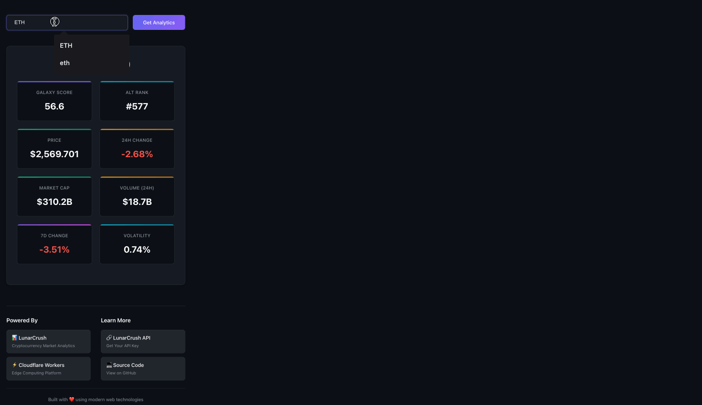
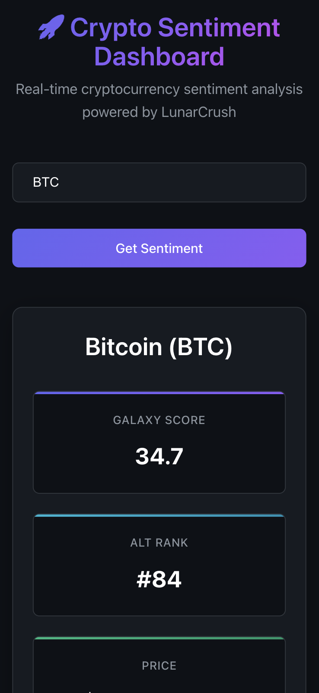
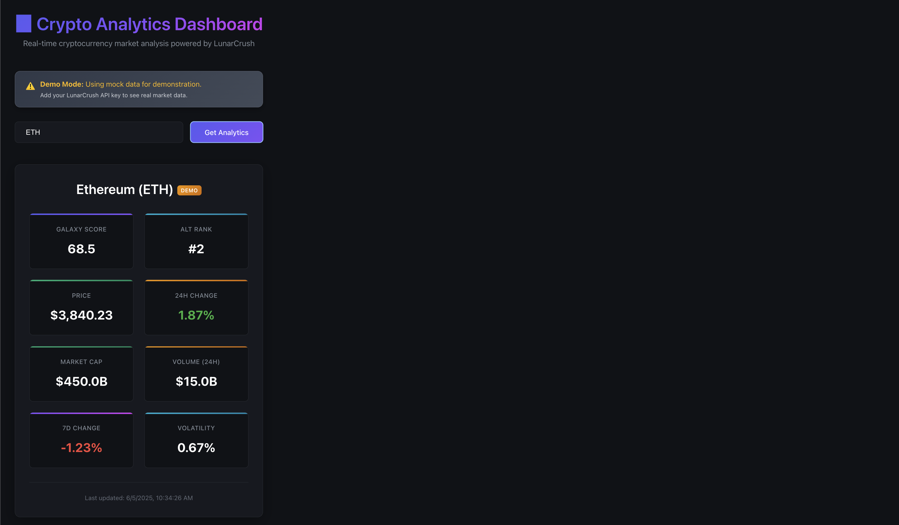
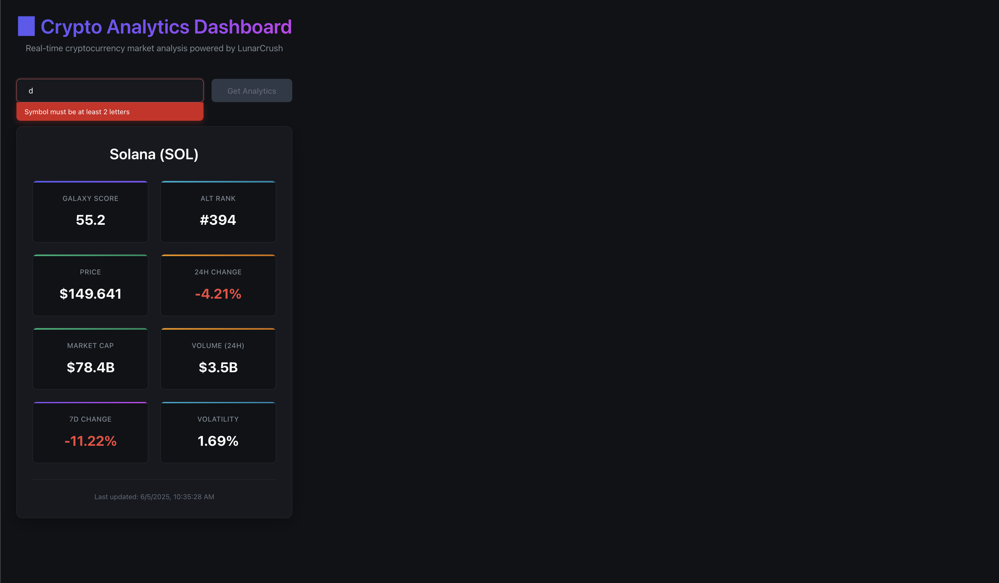

# 🚀 Crypto Sentiment Dashboard

> A lightning-fast cryptocurrency sentiment analysis dashboard built with modern web technologies and deployed to the edge.

[](https://crypto-sentiment-dashboard.mcp-server.workers.dev/)
[](https://workers.cloudflare.com/)
[](https://github.com/danilobatson/crypto-sentiment-vite-cloudflare)

## 📱 Live Demo


**[🚀 Try it live](https://crypto-sentiment-dashboard.mcp-server.workers.dev/)** - Search for any cryptocurrency to see real-time sentiment analysis!

## 🎬 See It In Action



*Search any cryptocurrency symbol to get instant sentiment analysis with Galaxy Score, Alt Rank, social volume, and price data.*

## ✨ Features

- **⚡ Edge-Deployed** - Runs on 300+ global Cloudflare locations for sub-50ms responses
- **🔥 Modern Stack** - Built with Vite, React, and Cloudflare Workers
- **📊 Real-time Data** - Live cryptocurrency sentiment analysis powered by LunarCrush API
- **🛡️ Robust Validation** - Input validation, error handling, and graceful fallbacks
- **🎭 Demo Mode** - Works with mock data when API key isn't available
- **📱 Fully Responsive** - Optimized for mobile, tablet, and desktop
- **🚀 Auto-Deploy** - Continuous deployment via GitHub Actions
- **🎨 Professional UI** - LunarCrush-inspired dark theme design

## 📱 Responsive Design



*Fully responsive design that works perfectly on mobile, tablet, and desktop devices.*

## 🎭 Demo Mode & Error Handling

| Demo Mode | Error Handling |
|:---:|:---:|
|  |  |
| *Demo mode with realistic mock data* | *Smart input validation and error handling* |

## 🎯 Why This Project?

This dashboard demonstrates modern full-stack development patterns while showcasing the power of edge computing. It's designed to be both educational and production-ready, teaching developers how to:

- Build full-stack applications with serverless architecture
- Integrate third-party APIs securely and efficiently
- Implement professional error handling and user experience patterns
- Deploy to global edge infrastructure with zero configuration
- Set up modern CI/CD workflows with GitHub Actions

## 🏗️ Architecture

```
┌─────────────────┐    ┌──────────────────┐    ┌─────────────────┐
│   React Frontend │────│ Cloudflare Worker │────│ LunarCrush API  │
│   (Vite + SPA)   │    │   (Edge API)     │    │   (Sentiment)   │
└─────────────────┘    └──────────────────┘    └─────────────────┘
        │                        │                        │
        │                        │                        │
    ┌───▼────┐              ┌────▼────┐              ┌───▼───┐
    │Browser │              │ Edge    │              │ Real  │
    │ Cache  │              │ Cache   │              │ Data  │
    └────────┘              └─────────┘              └───────┘
```

*Modern serverless architecture leveraging edge computing for optimal performance and global scalability.*
