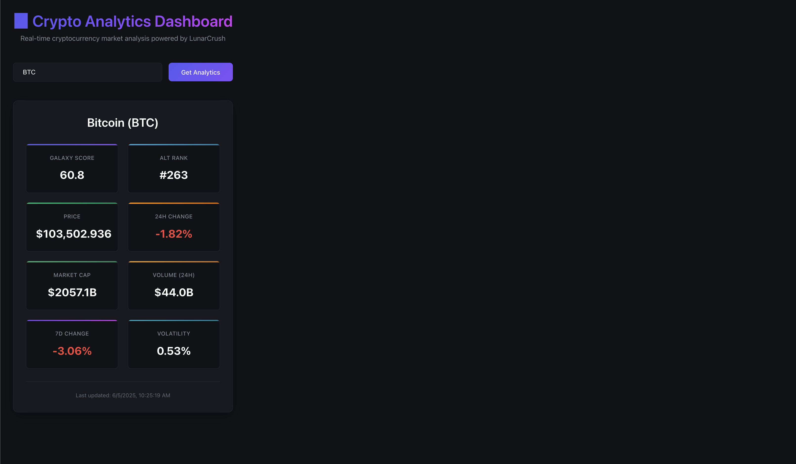

# 📊 Crypto Analytics Dashboard

> A lightning-fast cryptocurrency market analysis dashboard built with modern web technologies and deployed to the edge.

[](https://crypto-sentiment-dashboard.mcp-server.workers.dev/)
[](https://workers.cloudflare.com/)

## 📱 Live Demo



**[🚀 Try it live](https://crypto-sentiment-dashboard.mcp-server.workers.dev/)** - Search for any cryptocurrency to see real-time market analysis!

## 📖 Tutorial

**[📚 Read the complete tutorial](https://dev.to/dbatson/build-a-lightning-fast-crypto-sentiment-dashboard-with-vite-and-cloudflare-workers-in-15-minutes-1315)** - Learn how to build this crypto analytics dashboard step-by-step in 15 minutes.

This tutorial covers:

- Modern full-stack development with Vite and React
- Serverless architecture with Cloudflare Workers
- Real-time API integration with LunarCrush
- Professional CI/CD setup with GitHub Actions
- Production deployment to global edge network

Perfect for developers learning modern web development patterns and edge computing.

## 🎬 See It In Action


*Search any cryptocurrency symbol to get instant market analysis with Galaxy Score, Alt Rank, price data, and performance metrics.*

## ✨ Features

- **⚡ Edge-Deployed** - Runs on 300+ global Cloudflare locations for sub-50ms responses
- **🔥 Modern Stack** - Built with Vite, React, and Cloudflare Workers
- **📊 Real-time Data** - Live cryptocurrency market analysis powered by LunarCrush API
- **🏆 Galaxy Score & Rankings** - LunarCrush's proprietary market health metrics
- **💹 Market Metrics** - Price, market cap, volume, and performance data
- **🛡️ Robust Validation** - Input validation, error handling, and graceful fallbacks
- **🎭 Demo Mode** - Works with mock data when API key isn't available
- **📱 Fully Responsive** - Optimized for mobile, tablet, and desktop
- **🚀 Auto-Deploy** - Continuous deployment via GitHub Actions
- **🎨 Professional UI** - LunarCrush-inspired dark theme design

## 📱 Responsive Design


*Fully responsive design that works perfectly on mobile, tablet, and desktop devices.*

## 🎭 Demo Mode & Error Handling

| | |
|:-:|:-:|
|  |  |
| *Demo mode with realistic mock data* | *Smart input validation and error handling* |

## 🎯 Why This Project?

This dashboard demonstrates modern full-stack development patterns while showcasing the power of edge computing. It's designed to be both educational and production-ready, teaching developers how to:

- Build full-stack applications with serverless architecture
- Integrate third-party APIs securely and efficiently
- Implement professional error handling and user experience patterns
- Deploy to global edge infrastructure with zero configuration
- Set up modern CI/CD workflows with GitHub Actions

## 🏗️ Architecture

```bash
┌─────────────────┐    ┌──────────────────┐    ┌─────────────────┐
│   React Frontend │────│ Cloudflare Worker │────│ LunarCrush API  │
│   (Vite + SPA)   │    │   (Edge API)     │    │   (Analytics)   │
└─────────────────┘    └──────────────────┘    └─────────────────┘
        │                        │                        │
        │                        │                        │
    ┌───▼────┐              ┌────▼────┐              ┌───▼───┐
    │Browser │              │ Edge    │              │ Real  │
    │ Cache  │              │ Cache   │              │ Data  │
    └────────┘              └─────────┘              └───────┘
```

*Modern serverless architecture leveraging edge computing for optimal performance and global scalability.*

## 🚀 Quick Start

### Prerequisites

- Node.js 20+ installed
- A Cloudflare account (free tier works perfectly)
- Optional: LunarCrush API key for live data

### Local Development

1. **Clone the repository**

   ```bash
   git clone https://github.com/danilobatson/crypto-sentiment-vite-cloudflare.git
   cd crypto-sentiment-vite-cloudflare/crypto-sentiment-dashboard
   ```

2. **Install dependencies**

   ```bash
   npm install
   ```

3. **Set up environment (optional)**

   ```bash
   cp wrangler.example.toml wrangler.toml
   # Edit wrangler.toml and add your LunarCrush API key
   ```

4. **Start development server**

   ```bash
   npm run build && npx wrangler dev
   ```

5. **Open your browser**

   ```bash
   http://localhost:8787
   ```

### Production Deployment

1. **Deploy to Cloudflare Workers**

   ```bash
   npm run build
   npx wrangler deploy
   ```

2. **Set production API key**

   ```bash
   npx wrangler secret put LUNARCRUSH_API_KEY
   ```

3. **Your app is live!** 🎉

## 🔧 Configuration

### Environment Variables

| Variable             | Description                           | Required |
| -------------------- | ------------------------------------- | -------- |
| `LUNARCRUSH_API_KEY` | Your LunarCrush API key for live data | No*      |

*App works with realistic mock data when API key is not provided

### Wrangler Configuration

```toml
name = "crypto-sentiment-dashboard"
main = "api/index.js"
compatibility_date = "2025-06-05"

[assets]
directory = "./dist"

[vars]
LUNARCRUSH_API_KEY = "your_api_key_here"
```

## 🎮 Usage

### Basic Usage

1. **Search for any cryptocurrency** (BTC, ETH, SOL, ADA, etc.)
2. **View market metrics** including Galaxy Score, Alt Rank, and performance data
3. **Monitor price changes** with real-time data updates
4. **Responsive design** works on any device

### API Endpoints

- `GET /api/health` - Health check endpoint
- `GET /api/sentiment/:symbol` - Get market analytics for a cryptocurrency

### Example API Response

```json
{
  "symbol": "BTC",
  "name": "Bitcoin",
  "price": 104080.81,
  "galaxyScore": 46.3,
  "altRank": 306,
  "marketCap": 2068578645007.58,
  "volume24h": 41976305116.99,
  "percentChange24h": -1.07,
  "percentChange7d": -2.54,
  "percentChange30d": 7.27,
  "volatility": 0.0045,
  "marketCapRank": 1,
  "timestamp": "2025-06-05T03:30:00.000Z",
  "isMockData": false
}
```

## 🛠️ Technology Stack

### Frontend

- **React 18** - Modern UI library with hooks
- **Vite 4** - Lightning-fast build tool and dev server
- **CSS3** - Custom styling with modern features

### Backend

- **Cloudflare Workers** - Serverless edge computing platform
- **Hono** - Fast web framework for edge environments
- **LunarCrush API** - Cryptocurrency market analytics data

### DevOps

- **GitHub Actions** - Automated CI/CD pipeline
- **Wrangler** - Cloudflare Workers deployment tool
- **Edge Caching** - Global content delivery and API caching

## 📊 Performance

- **Global Latency**: < 50ms worldwide
- **Edge Locations**: 300+ Cloudflare data centers
- **Caching Strategy**: 5-minute API cache, browser caching optimized
- **Lighthouse Score**: 95+ across all metrics

## 🧠 Understanding LunarCrush Metrics

### Galaxy Score

LunarCrush's proprietary metric that evaluates a cryptocurrency's overall market health by analyzing various factors including price performance, market activity, and social engagement. Scores range from 0-100, with higher scores indicating stronger market position.

### Alt Rank

Measures how a cryptocurrency is performing relative to all other cryptocurrencies that LunarCrush tracks. A lower number indicates better performance - for example, Alt Rank #1 means the best performing cryptocurrency in their system.

### Market Metrics

- **Market Cap**: Total value of all coins in circulation
- **Volume**: Trading activity over the last 24 hours
- **Volatility**: Price stability measurement
- **Performance**: 24h, 7d, and 30d percentage changes

## 🤝 Contributing

We welcome contributions! Here's how to get started:

1. **Fork the repository**
2. **Create a feature branch** (`git checkout -b feature/amazing-feature`)
3. **Make your changes** with proper commit messages
4. **Add tests** if applicable
5. **Submit a pull request**

### Development Guidelines

- Follow existing code style and patterns
- Add comments for complex logic
- Test your changes thoroughly
- Update documentation as needed

## 🔒 Security

- API keys are managed securely via Cloudflare Workers secrets
- Input validation prevents injection attacks
- CORS properly configured for cross-origin requests
- Rate limiting implemented to prevent abuse

## 📈 Roadmap

- [ ] **Real-time WebSocket updates** for live market streaming
- [ ] **Historical data charts** with interactive graphs
- [ ] **Portfolio tracking** for multiple cryptocurrencies
- [ ] **Price alerts** for threshold notifications
- [ ] **Mobile app** with React Native
- [ ] **Advanced analytics** with trend analysis and predictions

## 🆘 Troubleshooting

### Common Issues

**Q: Getting "Invalid symbol format" error?**
A: Ensure you're using 2-10 letter symbols only (e.g., BTC, ETH, not BTC123)

**Q: See "Demo Mode" banner?**
A: You're using mock data. Add your LunarCrush API key for live data.

**Q: Deployment failing?**
A: Check that your Cloudflare API token has Workers:Edit permissions.

**Q: API returning errors?**
A: Verify your LunarCrush API key is valid and has sufficient quota.

## 📄 License

This project is licensed under the MIT License - see the [LICENSE](LICENSE) file for details.

## 🙏 Acknowledgments

- **LunarCrush** for providing cryptocurrency market analytics data
- **Cloudflare** for the amazing Workers platform
- **Vite team** for the incredible build tool
- **React team** for the fantastic UI library

## 📞 Support

- **Issues**: [GitHub Issues](https://github.com/danilobatson/crypto-sentiment-vite-cloudflare/issues)
- **Discussions**: [GitHub Discussions](https://github.com/danilobatson/crypto-sentiment-vite-cloudflare/discussions)
- **Tutorial**: [Complete tutorial available!](https://dev.to/yourusername/your-article-slug)

---

⭐ **If this project helped you, please consider giving it a star!** ⭐
